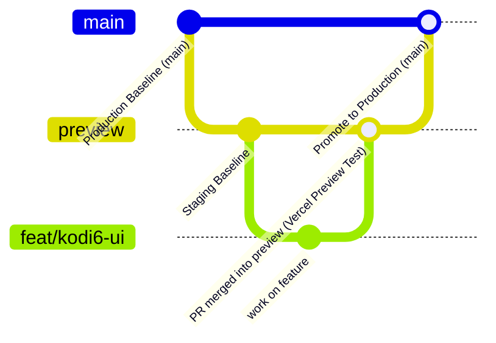

# 🚀 The Embrione & Kodikon Web Portal

Official web repository for **The Embrione** — the technical vertical under the Department of Computer Science and Engineering at **PES University, Bengaluru** — and the official platform for **Kodikon**, our flagship national-level 24-hour hackathon.

[](https://nextjs.org/)
[](https://tailwindcss.com/)
[](https://www.framer.com/motion/)
[](https://pes.edu/)
[](./LICENSE)

---

## 📌 Table of Contents

- [Overview](#-overview)
- [Tech Stack](#-tech-stack)
- [Project Architecture & Directory Structure](#-project-architecture--directory-structure)
- [Getting Started & Local Setup](#-getting-started--local-setup)
- [Environment Variables](#-environment-variables)
- [Key Features & Routes](#-key-features--routes)
- [How to Update Content](#-how-to-update-content)
- [Collaboration & Preview Workflow](#-collaboration--preview-workflow)
- [Domain & Deployment Setup (Vercel & DNS)](#-domain--deployment-setup-vercel--dns)
- [Troubleshooting & FAQs](#-troubleshooting--faqs)
- [Club Maintainers & Contact](#-club-maintainers--contact)
- [License](#-license)

---

## 🌐 Overview

This application serves two main purposes:
1. **Club Hub (`/`)**: Showcases Embrione's mission, domain leads, core committee, past hackathons, learning initiatives (Cipher, Spark), announcements, and contact channels.
2. **Kodikon Hackathon Portal (`/kodikon-5`)**: The registration and information portal for Kodikon 5.0 (with historical archives for 4.0 and 3.0), featuring research-backed tracks, interactive theme popups, countdown clocks, event timeline, prizes, sponsors, partners, and FAQs.

---

## 🛠 Tech Stack

- **Framework**: [Next.js 13.5](https://nextjs.org/) (Hybrid App Router + Pages API)
- **Styling**: [Tailwind CSS](https://tailwindcss.com/) with custom dark neon palette (`dark-navy`, cyan glows, matrix rain keyframes)
- **Animations & Interactivity**:
  - [Framer Motion](https://www.framer.com/motion/) for fluid page entries and scroll transitions
  - [Lottie React](https://github.com/Gamote/lottie-react) for interactive vector animations
  - [use-scramble](https://use-scramble.vercel.app/) for futuristic cyberpunk terminal text effects
  - [AOS (Animate On Scroll)](https://michalsnik.github.io/aos/)
  - [Swiper](https://swiperjs.com/) for touch-friendly event photo carousels
- **Icons**: [Lucide React](https://lucide.dev/) & [React Icons](https://react-icons.github.io/react-icons/)
- **Forms & Notifications**: `react-hook-form`, `react-toastify`, and `axios`
- **Backend & Integrations**:
  - [Nodemailer](https://nodemailer.com/) (Gmail SMTP relay for `/api/sendMessage`)
  - [Firebase SDK](https://firebase.google.com/) (Firestore initialization)

---

## 📂 Project Architecture & Directory Structure

All components are strictly modularized into dedicated folders under `components/` matching Next.js best practices:

```text
kodi5-website/
├── app/                                # Next.js App Router
│   ├── layout.js                       # Root layout (fonts, global metadata)
│   ├── globals.css                     # Global styles, scrollbar, neon gradients
│   ├── page.js                         # Embrione Club Landing Page
│   ├── kodikon-5/                      # Kodikon 5.0 Landing Page
│   │   ├── page.js
│   │   └── layout.js
│   ├── kodikon-4/                      # Kodikon 4.0 Archive Page
│   └── kodikon-3/                      # Kodikon 3.0 Archive Page
│
├── components/                         # Modular React components (one folder per section)
│   ├── Navbar/                         # Main club header navigation
│   │   └── Navbar.jsx
│   ├── Hero/                           # Club hero with scramble text & orbit animation
│   │   └── Hero.jsx
│   ├── AboutUs/                        # Club mission & background
│   │   └── AboutUs.jsx
│   ├── Team/                           # Domain heads & cores grid
│   │   └── Team.jsx
│   ├── PastEvents/                     # Historical events viewer & photo carousel
│   │   ├── PastEvents.jsx
│   │   └── PastEventsCarousel.jsx
│   ├── Announcements/                  # Recruitment and hackathon announcements
│   │   ├── AnnouncementComponent.jsx
│   │   ├── Announcements.jsx
│   │   └── NavbarAnnouncementComponent.jsx
│   ├── PreviousPartners/               # Previous sponsors & partners logo grid
│   │   ├── PreviousPartner.jsx
│   │   ├── PreviousPartners.jsx
│   │   └── logos/
│   ├── ContactUs/                      # Contact form with email API trigger
│   │   └── ContactUs.jsx
│   ├── Footer/                         # PES branding, socials, contacts
│   │   └── Footer.jsx
│   ├── ScrollProgress/                 # Top scroll progress bar
│   │   └── ScrollProgressComponent.jsx
│   ├── BottomNavigation/               # Mobile sticky navigation
│   │   └── BottomNavigationComponent.jsx
│   │
│   └── Kodikon-5/                      # Kodikon 5.0 specific components
│       ├── NavbarKodikon5.jsx          # Hackathon sticky navbar
│       ├── HeroComponent.jsx           # Matrix rain effect + title sponsor
│       ├── AboutTheEvent/              # Event narrative & stats
│       ├── Countdown/                  # Dynamic registration countdown
│       ├── HackathonThemes/            # 3 research tracks + detail popups
│       ├── Timeline/                   # 5-stage interactive vertical roadmap
│       ├── Sponsors/                   # Pixcellence title sponsor showcase
│       ├── Partners/                   # Hack2Skill partner section
│       ├── Prizes/                     # First, second, third prize badges
│       ├── FAQComponent.jsx            # 14 hackathon Q&A accordions
│       ├── MapComponent.jsx            # PES Dr. MRD Block embed & directions
│       └── FAQData.js                  # FAQ content source
│
├── pages/api/                          # Next.js API Routes
│   ├── sendMessage.js                  # Contact form email delivery via Nodemailer
│   └── getTime.js                      # Server-synchronized countdown timestamp
│
├── public/                             # Public static assets
│   ├── 2025-domain-heads/              # 2025 domain head & core headshots (27 photos)
│   ├── current-domain-heads/           # 2024 domain head photos (18 photos archive)
│   ├── domiainHeadPhotos/              # 2023 domain head photos (9 photos archive)
│   ├── Kodikon5/                       # Theme thumbnails, logos, prize images
│   ├── Kodikon4/                       # Kodikon 4.0 graphics, prize.png, sponsor assets
│   ├── Kodikon3/                       # Kodikon 3.0 graphics
│   ├── sponsors/                       # Sponsor logos (Tech, Food, Travel)
│   ├── Partners/                       # Hack2Skill and platform partner logos
│   └── Cipher/, Spark/, Kodikon1-2/   # Past event photo galleries
│
├── assets/                             # Lottie JSON animations
│   ├── about-kodikon.json
│   ├── blue-orbit.json
│   └── contact.json
│
├── constants.js                        # Master data file (Team, Events, Socials, Announcements)
├── firebaseConfig.js                   # Firebase client configuration
├── tailwind.config.js                  # Tailwind theme, typography & keyframes
├── LICENSE                             # MIT License
├── .env.example                        # Environment variable template
└── package.json                        # Dependencies and npm scripts
```

---

## ⚡ Getting Started & Local Setup

### 1. Prerequisites
- **Node.js**: `v18.x` or higher installed ([Download](https://nodejs.org/))
- **Package Manager**: `npm`, `yarn`, or `pnpm`
- **Git**: Installed and configured

### 2. Clone & Install
```bash
# Clone the repository
git clone https://github.com/The-Embrione-Website/embrione-pes.git
cd kodi5-website

# Install dependencies (use --legacy-peer-deps for dependency resolution)
npm install --legacy-peer-deps
```

### 3. Setup Environment Variables
Create a local `.env.local` file:
```bash
cp .env.example .env.local
```
Add your credentials (see [Environment Variables](#-environment-variables)).

### 4. Run Development Server
```bash
npm run dev
```
Open [http://localhost:3000](http://localhost:3000) in your browser.
To view the Kodikon 5 page directly, visit [http://localhost:3000/kodikon-5](http://localhost:3000/kodikon-5).

### 5. Production Build Verification
```bash
npm run build
npm run start
```

---

## 🔑 Environment Variables

The application supports the following environment variables in `.env.local`:

| Variable | Description | Required For |
|---|---|---|
| `APP_PASSWORD` | Google App Password for `theembrionetech@gmail.com` | Contact form submission via `/api/sendMessage` |

> [!NOTE]
> If testing the frontend without sending live emails, `APP_PASSWORD` can be omitted, but `/api/sendMessage` will fail with an authentication error on form submit.

---

## 🗺 Key Features & Routes

| Route | Description | Primary Components |
|---|---|---|
| `/` | Embrione Club official portal | `Hero`, `AboutUs`, `Team`, `PastEvents`, `Announcements`, `ContactUs`, `Footer` |
| `/kodikon-5` | Kodikon 5.0 Hackathon portal | `HeroComponent`, `AboutTheEvent`, `HackathonThemes`, `EventTimeline`, `Sponsors`, `Partners`, `Prizes`, `FAQ`, `Map` |
| `/kodikon-4` | Kodikon 4.0 Archive | `Kodikon-4/*` |
| `/kodikon-3` | Kodikon 3.0 Archive | `Kodikon-3/*` |
| `/api/sendMessage` | Contact API route | Handles contact form POST submissions and dispatches emails to `embrione_cse@pes.edu` |
| `/api/getTime` | Countdown sync API | Returns synchronized timestamp for countdown timers |

---

## ✏️ How to Update Content

### 👥 Updating Team Members
Edit `constants.js` under the `teamMembersDetails` array:
```javascript
{
  name: "Full Name",
  domain: "Web Development", // WebDev, Event Management, Sponsorship, Design, Operations, Logistics, Hospitality, Social Media, Campaigning
  role: "Head",              // "Head" or "Core"
  photoUrl: "/2025-domain-heads/YourPhoto.jpg", // Place image in public/2025-domain-heads/
  linkedinUrl: "https://www.linkedin.com/in/username/",
  srn: "PES1UG23CSxxx",
  email: "your.email@example.com",
}
```

### 🎯 Updating Hackathon Tracks & Themes
Edit `components/Kodikon-5/HackathonThemes/HackathonThemes.jsx`:
- Modify the `themes` array to adjust track titles, descriptions, application areas, and academic literature links.
- Place track banner images in `public/Kodikon5/themes-thumbnail/`.

### ❓ Updating FAQs
Edit `components/Kodikon-5/FAQData.js`:
- Add or modify questions and answers in `faqData`.

### 📅 Updating Event Timeline
Edit `components/Kodikon-5/Timeline/EventTimelineComponent.jsx`:
- Update `timelineEvents` with the new milestones, dates, descriptions, and icons.

### 📢 Updating Announcements
Edit `constants.js` under `announcements`:
- Add new announcement objects with `status: "Open"` or `"Closed"` and appropriate `formLink`.

---

## 🌿 Collaboration & Preview Workflow

To allow everyone to test features in real-time with **Vercel Previews** without breaking production, we follow a two-tier branching strategy:

- **`main`**: The **Production** branch. Only verified, release-ready code is merged here.
- **`preview`**: The **Staging / Preview** branch. Every PR targeting `preview` automatically gets a live, shareable Vercel Preview URL.



### Step-by-Step Contribution Workflow

#### 1. Always branch off `preview`
```bash
# Switch to preview and pull the latest changes
git checkout preview
git pull origin preview

# Create your descriptive feature branch
git checkout -b feat/your-feature-name      # e.g. feat/kodi6-tracks
# or: git checkout -b fix/navbar-bug
```

#### 2. Commit Standards
Write clear, conventional commit messages:
```bash
git commit -m "feat: add interactive track popup for AI theme"
git commit -m "fix: correct registration countdown timezone"
git commit -m "style: refine footer padding on mobile screens"
```

#### 3. Push and Open a Pull Request targeting `preview`
```bash
git push -u origin feat/your-feature-name
```
On GitHub:
- Set **Base branch**: `preview`
- Set **Compare branch**: `feat/your-feature-name`

#### 4. Test the Live Vercel Preview
- Once the PR is opened, the Vercel GitHub bot will post a comment with a unique **Preview Deployment URL** (e.g. `https://embrione-pes-git-feat-your-feature-...vercel.app`).
- Test your changes directly on mobile and desktop using that link!

#### 5. Merge into `preview` ➔ Promote to `main`
- After code review, merge your PR into `preview`.
- Once all staging features on `preview` are verified, a designated lead will open a PR from `preview` into `main` to deploy to production.

---

## 🌐 Domain & Deployment Setup (Vercel & DNS)

If you are connecting custom domains (`embrionepes.in` or `www.embrionepes.in`):

### 1. Vercel Configuration
1. Open your project on the [Vercel Dashboard](https://vercel.com/).
2. Navigate to **Settings** ➔ **Domains**.
3. Add both:
   - `embrionepes.in`
   - `www.embrionepes.in`

### 2. Registrar (GoDaddy / Hostinger / BigRock) DNS Records
Ensure your registrar's DNS records point to Vercel instead of parking servers:

| Record Type | Name / Host | Target / Points To | Purpose |
|---|---|---|---|
| **A** | `@` | `76.76.21.21` | Direct apex domain to Vercel |
| **CNAME** | `www` | `cname.vercel-dns.com` | Direct www subdomain to Vercel |

---

## ❓ Troubleshooting & FAQs

### Q: Why does the domain redirect to `/lander`?
**A:** This happens when the domain registrar (e.g. GoDaddy) has the domain parked. It means either:
1. The domain registration expired and needs renewal at the registrar.
2. The DNS `A` record is still set to GoDaddy's default parking IP (`13.248.213.45`) instead of Vercel's IP (`76.76.21.21`).
*Note: Your local site (`npm run dev`) and Vercel preview links will work normally.*

### Q: `npm install` throws peer dependency warnings?
**A:** Use the `--legacy-peer-deps` flag:
```bash
npm install --legacy-peer-deps
```

### Q: How do I verify my build before pushing?
**A:** Always run:
```bash
npm run build
```
Ensure all 8 routes generate with `✓ Generating static pages (8/8)` before opening a PR.

---

## 📬 Club Maintainers & Contact

- **Organization**: The Embrione — Department of Computer Science & Engineering
- **Institution**: PES University, Ring Road Campus, Banashankari, Bengaluru, Karnataka 560085
- **Official Email**: [embrione_cse@pes.edu](mailto:embrione_cse@pes.edu)
- **Tech Team**: [theembrionetech@gmail.com](mailto:theembrionetech@gmail.com)
- **Instagram**: [@the_embrione.pesu](https://www.instagram.com/the_embrione.pesu/)
- **LinkedIn**: [The Embrione](https://www.linkedin.com/company/the-embrione/about/)
- **Lead Contacts**:
  - Kunjal Patwari (Club Head): [patwarikunjal@gmail.com](mailto:patwarikunjal@gmail.com)
  - Preksha M (Club Head): [preksham2004@gmail.com](mailto:preksham2004@gmail.com)
  - Vishal P (Web Development Head): [vishal04p74@gmail.com](mailto:vishal04p74@gmail.com)

---

## 📄 License

This project is licensed under the [MIT License](./LICENSE) &copy; 2025-2026 The Embrione, PES University.

---

<p align="center">Made with ♥ by <b>The Embrione WebDev Team</b></p>
